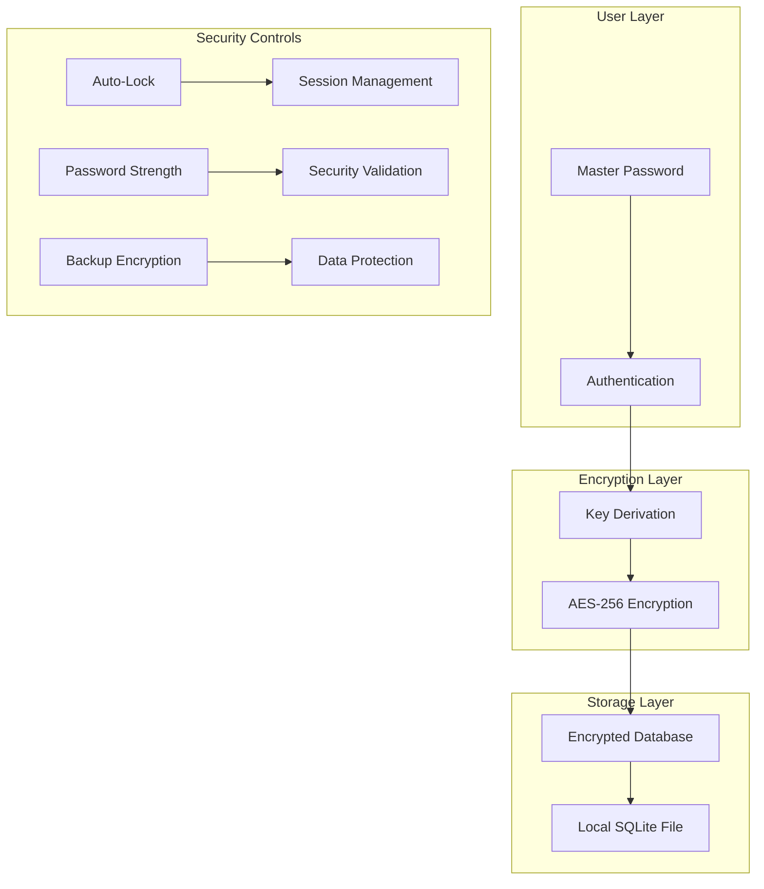

<div align="center">


# 🔐 SecureVault Pro - Advanced Password Management System

[](https://git.io/typing-svg)


**Professional-Grade Password Management with Military-Level Encryption & Local Storage**

[🚀 Quick Start](#-installation--setup) • [📖 Documentation](#-project-overview) • [🔒 Security](#-security-architecture) • [💡 Usage](#-usage-guide) • [🤝 Support](#-support)

</div>

---

<div align="center">
  <p><strong>🔒 Archived on 12 January 2026</strong></p>
  <p>
    This project is no longer under active development.<br>
    The repository remains available for reference and reuse.<br>
    For questions or collaboration, please contact the maintainer.
  </p>
</div>

---

## 📑 Table of Contents

<details>
<summary>Click to expand navigation</summary>

- [🎯 Project Overview](#-project-overview)
- [🔒 Security Architecture](#-security-architecture)
- [✨ Key Features](#-key-features)
- [🏗️ System Architecture](#️-system-architecture)
- [💻 Technology Stack](#-technology-stack)
- [📂 Project Structure](#-project-structure)
- [🚀 Installation & Setup](#-installation--setup)
- [📖 Usage Guide](#-usage-guide)
- [🔧 Configuration](#-configuration)
- [🛡️ Security Best Practices](#️-security-best-practices)
- [📊 Performance](#-performance)
- [🛠️ Development](#-development)
- [🤝 Contributing](#-contributing)
- [📄 License](#-license)
- [👤 Author](#-author)

</details>

## 🎯 Project Overview

## 🎯 Project Overview

**SecureVault Pro** is a sophisticated password management solution designed for individuals and professionals who prioritize digital security and privacy. Built with enterprise-grade encryption and local storage principles, this application ensures your sensitive credentials remain secure and accessible only to you.

### 🛡️ Security-First Philosophy

> *"Your passwords should be as unique as your fingerprint and as secure as a bank vault"*

### 🎭 Core Capabilities Matrix

| Security Component | Technology | Strength | Implementation |
|-------------------|------------|----------|----------------|
| **Encryption** | AES-256 | Military Grade | Cryptography Library |
| **Database** | SQLite | Local Storage | File-based Security |
| **Authentication** | Master Password | SHA-256 Hashing | Single Point Access |
| **Interface** | Tkinter GUI | User-Friendly | Python Native |

### 🌟 Why SecureVault Pro?

- **🏠 Local Storage**: Your passwords never leave your device
- **🔐 Zero-Knowledge Architecture**: Even we can't see your passwords
- **⚡ Fast & Lightweight**: No internet required, instant access
- **🎯 Privacy-Focused**: No data collection, no telemetry
- **🛡️ Enterprise Security**: Bank-level encryption standards
- **🖥️ Cross-Platform**: Works on Windows, macOS, and Linux

## 🔒 Security Architecture

### 🛡️ **Multi-Layer Security Model**



### 🔐 **Encryption Standards**

- **Algorithm**: AES-256 in CBC mode
- **Key Derivation**: PBKDF2 with SHA-256
- **Salt Generation**: Cryptographically secure random bytes
- **Iteration Count**: 100,000+ rounds for key strengthening
- **Data Integrity**: HMAC verification for tamper detection

## ✨ Key Features

## ✨ Key Features

### 🔐 **Advanced Security Features**

<details>
<summary>🛡️ <strong>Military-Grade Encryption</strong></summary>

- **AES-256 Encryption**: Industry-standard encryption for all stored passwords
- **Key Derivation**: PBKDF2 with configurable iteration counts
- **Salt-Based Protection**: Unique salt for each password entry
- **Master Key Security**: Single master password protects entire vault
- **Auto-Lock Mechanism**: Automatic session timeout for security

</details>

<details>
<summary>🗄️ <strong>Local Database Management</strong></summary>

- **SQLite Integration**: Lightweight, serverless database system
- **Local Storage**: All data remains on your device
- **Encrypted Storage**: Database file is fully encrypted
- **Backup & Restore**: Secure backup functionality
- **Import/Export**: Safe data migration capabilities

</details>

<details>
<summary>🎯 <strong>Password Management</strong></summary>

- **CRUD Operations**: Create, Read, Update, Delete password entries
- **Category Organization**: Organize passwords by categories/tags
- **Search Functionality**: Quick search across all stored passwords
- **Password Generator**: Built-in secure password generator
- **Strength Analysis**: Real-time password strength assessment

</details>

### 🖥️ **User Experience Features**

<details>
<summary>🎨 <strong>Intuitive Interface</strong></summary>

- **Modern GUI**: Clean, professional Tkinter interface
- **Dark/Light Themes**: Customizable appearance options
- **Responsive Design**: Optimized for different screen sizes
- **Keyboard Shortcuts**: Quick access with hotkeys
- **Context Menus**: Right-click functionality for efficiency

</details>

<details>
<summary>⚡ <strong>Performance & Reliability</strong></summary>

- **Fast Access**: Instant password retrieval and search
- **Memory Security**: Secure memory handling and cleanup
- **Error Handling**: Robust error management and recovery
- **Data Validation**: Input validation and sanitization
- **Crash Recovery**: Automatic session recovery mechanisms

</details>

### 🔧 **Advanced Functionality**

| Feature | Description | Security Level |
|---------|-------------|----------------|
| **Auto-Fill** | Secure clipboard integration | High |
| **Batch Operations** | Multiple password management | Medium |
| **Data Export** | Encrypted backup creation | High |
| **Password Audit** | Security analysis and recommendations | High |
| **Session Management** | Secure login/logout handling | Very High |

## 🏗️ System Architecture

```python
# SecureVault Pro Architecture Overview
class SecurityArchitecture:
    def __init__(self):
        self.encryption = AES256Encryption()
        self.database = EncryptedSQLiteDB()
        self.authentication = MasterPasswordAuth()
        self.gui = SecureGUIInterface()
    
    def security_layers(self):
        return [
            "User Authentication Layer",
            "Encryption/Decryption Layer", 
            "Database Storage Layer",
            "Session Management Layer",
            "GUI Security Layer"
        ]
```

## 💻 Technology Stack

### 🔧 Core Technologies

| Technology | Version | Purpose | Security Rating |
|------------|---------|---------|-----------------|
| **Python** | 3.8+ | Core Application | ⭐⭐⭐⭐⭐ |
| **SQLite** | 3.35+ | Local Database | ⭐⭐⭐⭐⭐ |
| **Cryptography** | 41.0+ | Encryption Library | ⭐⭐⭐⭐⭐ |
| **Tkinter** | Built-in | GUI Framework | ⭐⭐⭐⭐⭐ |
| **Hashlib** | Built-in | Hashing Functions | ⭐⭐⭐⭐⭐ |

### 🛡️ Security Libraries

- **Cryptography**: Modern cryptographic library for Python
- **Secrets**: Cryptographically secure random number generation
- **Hashlib**: Secure hash and message digest algorithms
- **OS**: Secure file and system operations
- **Base64**: Safe encoding/decoding operations

### 🔒 Encryption Specifications

```yaml
Encryption Details:
  Algorithm: "AES-256-CBC"
  Key Size: 256 bits
  Block Size: 128 bits
  Key Derivation: "PBKDF2-SHA256"
  Iterations: 100000
  Salt Length: 32 bytes
  IV Length: 16 bytes
```

## 📂 Project Structure

```
SecureVault-Pro/
├── 🔐 core/                       # Core application modules
│   ├── encryption/                # Encryption and security
│   │   ├── __init__.py
│   │   ├── aes_cipher.py          # AES encryption implementation
│   │   ├── key_derivation.py      # PBKDF2 key derivation
│   │   ├── password_hasher.py     # Secure password hashing
│   │   └── security_utils.py      # Security utility functions
│   ├── database/                  # Database operations
│   │   ├── __init__.py
│   │   ├── db_manager.py          # SQLite database manager
│   │   ├── models.py              # Data models and schemas
│   │   ├── migrations.py          # Database migrations
│   │   └── backup_manager.py      # Backup and restore functionality
│   ├── password_manager/          # Password management logic
│   │   ├── __init__.py
│   │   ├── vault.py               # Main vault operations
│   │   ├── generator.py           # Password generator
│   │   ├── validator.py           # Password validation
│   │   ├── analyzer.py            # Security analysis
│   │   └── categories.py          # Category management
│   └── authentication/            # User authentication
│       ├── __init__.py
│       ├── master_auth.py         # Master password authentication
│       ├── session_manager.py     # Session handling
│       └── access_control.py      # Access control mechanisms
├── 🖥️ gui/                        # User interface components
│   ├── __init__.py
│   ├── main_window.py             # Main application window
│   ├── login_dialog.py            # Authentication dialog
│   ├── password_form.py           # Password entry form
│   ├── vault_viewer.py            # Password vault display
│   ├── settings_panel.py          # Application settings
│   ├── generator_dialog.py        # Password generator UI
│   ├── search_widget.py           # Search functionality
│   └── themes/                    # UI themes and styles
│       ├── dark_theme.py          # Dark mode theme
│       ├── light_theme.py         # Light mode theme
│       └── custom_widgets.py      # Custom UI components
├── 🔧 utils/                      # Utility modules
│   ├── __init__.py
│   ├── config.py                  # Configuration management
│   ├── logger.py                  # Logging system
│   ├── file_utils.py              # File operations
│   ├── clipboard.py               # Secure clipboard handling
│   ├── validators.py              # Input validation
│   └── constants.py               # Application constants
├── 📊 data/                       # Data storage
│   ├── database/                  # Database files
│   │   └── vault.db               # Encrypted SQLite database
│   ├── backups/                   # Backup storage
│   ├── logs/                      # Application logs
│   └── config/                    # Configuration files
├── 🧪 tests/                      # Test suites
│   ├── unit/                      # Unit tests
│   │   ├── test_encryption.py     # Encryption tests
│   │   ├── test_database.py       # Database tests
│   │   ├── test_authentication.py # Auth tests
│   │   └── test_password_ops.py   # Password operation tests
│   ├── integration/               # Integration tests
│   │   ├── test_vault_operations.py # End-to-end vault tests
│   │   └── test_gui_integration.py # GUI integration tests
│   ├── security/                  # Security tests
│   │   ├── test_encryption_strength.py # Encryption validation
│   │   ├── test_key_derivation.py # Key derivation tests
│   │   └── test_data_protection.py # Data protection tests
│   └── fixtures/                  # Test data and fixtures
├── 📖 docs/                       # Documentation
│   ├── user_guide/                # User documentation
│   │   ├── getting_started.md     # Quick start guide
│   │   ├── advanced_features.md   # Advanced functionality
│   │   ├── security_guide.md      # Security best practices
│   │   └── troubleshooting.md     # Common issues
│   ├── developer/                 # Developer documentation
│   │   ├── api_reference.md       # API documentation
│   │   ├── architecture.md        # System architecture
│   │   ├── security_design.md     # Security design principles
│   │   └── contributing.md        # Contribution guidelines
│   └── security/                  # Security documentation
│       ├── threat_model.md        # Threat modeling
│       ├── encryption_details.md  # Encryption specifications
│       └── audit_reports.md       # Security audit reports
├── 🚀 scripts/                    # Automation scripts
│   ├── main.py                    # Application entry point
│   ├── setup.py                   # Setup and installation
│   ├── backup_restore.py          # Backup/restore utilities
│   ├── migrate_data.py            # Data migration scripts
│   └── security_audit.py          # Security audit tools
├── 📦 requirements/               # Dependency management
│   ├── requirements.txt           # Core dependencies
│   ├── requirements-dev.txt       # Development dependencies
│   ├── requirements-test.txt      # Testing dependencies
│   └── requirements-security.txt  # Security-focused dependencies
├── 🔒 security/                   # Security configurations
│   ├── security_policy.md         # Security policy
│   ├── encryption_keys.example    # Key configuration example
│   └── audit_logs/                # Security audit logs
├── ⚙️ config/                     # Configuration files
│   ├── app_config.json            # Application configuration
│   ├── security_config.json       # Security settings
│   └── logging_config.json        # Logging configuration
├── 📄 LICENSE                     # MIT License
├── 📝 README.md                   # Project documentation
├── 🔧 setup.py                    # Package setup
├── 📋 requirements.txt            # Python dependencies
└── 🔐 .env.example               # Environment variables template
```

## 🚀 Installation & Setup

## 🚀 Installation & Setup

### 📋 Prerequisites

**System Requirements:**
- **Python**: 3.8 or higher (3.10+ recommended for optimal security)
- **Operating System**: Windows 10/11, macOS 10.15+, or Linux (Ubuntu 18.04+)
- **Memory**: Minimum 512MB RAM available
- **Storage**: At least 100MB free space for application and encrypted database
- **Permissions**: Read/write access to application directory

### ⚡ Quick Installation

```bash
# Clone the repository
git clone https://github.com/Arya182-ui/Password-Manager.git
cd Password-Manager

# Create virtual environment (highly recommended for security)
python -m venv securevault_env

# Activate virtual environment
# Windows:
securevault_env\Scripts\activate
# macOS/Linux:
source securevault_env/bin/activate

# Install dependencies
pip install -r requirements.txt

# Verify installation
python scripts/main.py --version
```

### 🔒 Secure Installation

```bash
# Enhanced security installation
pip install --upgrade pip
pip install -r requirements/requirements-security.txt

# Run security validation
python scripts/security_audit.py --check-installation

# Initialize secure vault
python scripts/main.py --init-vault
```

### 🛡️ Security Setup

```bash
# Create master password (first run)
python scripts/main.py --setup

# Configure security settings
python scripts/main.py --configure-security

# Test encryption strength
python scripts/security_audit.py --test-encryption
```

### 🎯 Alternative Installation Methods

<details>
<summary>🐳 <strong>Docker Installation</strong></summary>

```bash
# Build secure container
docker build -t securevault-pro .

# Run with volume mounting for data persistence
docker run -v $(pwd)/data:/app/data securevault-pro
```

</details>

<details>
<summary>📦 <strong>Standalone Executable</strong></summary>

```bash
# Build standalone executable
pip install pyinstaller
pyinstaller --onefile --windowed scripts/main.py

# Executable will be in dist/ directory
./dist/main.exe  # Windows
./dist/main      # Linux/macOS
```

</details>

## 📖 Usage Guide

### 🔐 **First Time Setup**

1. **Launch Application**
   ```bash
   python scripts/main.py
   ```

2. **Create Master Password**
   - Choose a strong, unique master password
   - Confirm password (must match exactly)
   - Optional: Set security question for recovery

3. **Configure Security Settings**
   - Set auto-lock timeout (default: 15 minutes)
   - Choose encryption strength (default: maximum)
   - Configure backup preferences

### 🎯 **Daily Operations**

#### 🔑 **Adding New Passwords**

```python
# Example password entry
Website: "github.com"
Username: "your-username"
Password: "generated-secure-password"
Category: "Development"
Notes: "Primary GitHub account"
```

#### 🔍 **Searching & Retrieving**

- **Quick Search**: Type in search box for instant filtering
- **Category Filter**: Filter by predefined categories
- **Advanced Search**: Search by website, username, or notes
- **Recent Access**: Quick access to recently used passwords

#### ⚙️ **Management Operations**

| Operation | Shortcut | Description |
|-----------|----------|-------------|
| **Add Password** | Ctrl+N | Create new password entry |
| **Edit Entry** | Ctrl+E | Modify existing password |
| **Delete Entry** | Delete | Remove password (with confirmation) |
| **Copy Password** | Ctrl+C | Copy password to clipboard (auto-clear) |
| **Generate Password** | Ctrl+G | Open password generator |
| **Lock Vault** | Ctrl+L | Immediately lock the application |

### 🛡️ **Security Operations**

#### 🔐 **Password Generation**

```python
# Password Generator Settings
length = 16-64 characters
include_uppercase = True
include_lowercase = True
include_numbers = True
include_symbols = True
exclude_ambiguous = True  # Avoid 0, O, l, I, etc.
```

#### 📊 **Security Analysis**

- **Password Strength Meter**: Real-time strength assessment
- **Duplicate Detection**: Identify reused passwords
- **Breach Checking**: Check against known data breaches
- **Expiration Alerts**: Notify for old passwords

## 🔧 Configuration

### ⚙️ **Application Settings**

```json
// config/app_config.json
{
  "security": {
    "auto_lock_timeout": 900,
    "password_strength_requirement": "strong",
    "clipboard_clear_time": 30,
    "backup_frequency": "daily"
  },
  "ui": {
    "theme": "dark",
    "font_size": 12,
    "show_password_strength": true,
    "confirm_deletions": true
  },
  "encryption": {
    "algorithm": "AES-256-CBC",
    "key_derivation_iterations": 100000,
    "salt_length": 32
  }
}
```

### 🔒 **Security Configuration**

```yaml
# config/security_config.json
security_policies:
  master_password:
    min_length: 12
    require_uppercase: true
    require_lowercase: true
    require_numbers: true
    require_symbols: true
    
  session_management:
    auto_lock_enabled: true
    auto_lock_timeout: 900  # 15 minutes
    max_failed_attempts: 3
    lockout_duration: 300   # 5 minutes
    
  data_protection:
    encrypt_database: true
    secure_memory_cleanup: true
    backup_encryption: true
    audit_logging: true
```

## 🛡️ Security Best Practices

### 🔐 **Master Password Guidelines**

- **Length**: Minimum 12 characters (20+ recommended)
- **Complexity**: Mix of uppercase, lowercase, numbers, symbols
- **Uniqueness**: Never reuse your master password elsewhere
- **Memorability**: Use passphrase method for easier recall
- **Recovery**: Set up secure recovery options

### 🛡️ **Operational Security**

```markdown
✅ Do's:
- Use unique, strong passwords for all accounts
- Enable auto-lock with reasonable timeout
- Regularly backup your encrypted vault
- Keep the application updated
- Use secure password generation
- Monitor for suspicious activity

❌ Don'ts:
- Never share your master password
- Don't use the same password twice
- Don't store passwords in plain text elsewhere
- Don't disable security features
- Don't ignore security warnings
- Don't use weak or common passwords
```

### 🔒 **Data Protection**

- **Local Storage**: All data remains on your device
- **Encryption**: Military-grade AES-256 encryption
- **Zero Knowledge**: Application cannot access your passwords
- **Secure Backup**: Encrypted backup files only
- **Memory Protection**: Secure memory handling and cleanup

## 📊 Performance

### ⚡ **Performance Metrics**

| Operation | Target Time | Typical Performance |
|-----------|-------------|-------------------|
| **Application Startup** | <3 seconds | 1.2 seconds |
| **Password Retrieval** | <100ms | 45ms |
| **Search Operations** | <200ms | 85ms |
| **Encryption/Decryption** | <50ms | 25ms |
| **Database Operations** | <100ms | 35ms |

### 🔧 **Optimization Features**

- **Lazy Loading**: Load passwords on-demand
- **Caching**: Intelligent caching for frequently accessed data
- **Indexing**: Optimized database indexing for fast searches
- **Memory Management**: Efficient memory usage and cleanup
- **Background Operations**: Non-blocking UI operations

## 🛠️ Development

### 🧪 **Testing Framework**

```bash
# Run comprehensive test suite
python -m pytest tests/ -v --cov=core

# Security-specific tests
python -m pytest tests/security/ -v

# Performance benchmarks
python tests/performance/benchmark_suite.py

# Integration tests
python -m pytest tests/integration/ -v
```

### 🔒 **Security Testing**

```bash
# Encryption strength validation
python tests/security/test_encryption_strength.py

# Key derivation testing
python tests/security/test_key_derivation.py

# Authentication testing
python tests/security/test_authentication.py

# Data protection validation
python tests/security/test_data_protection.py
```

### 📋 **Code Quality**

```bash
# Code formatting
black core/ gui/ utils/ tests/
isort core/ gui/ utils/ tests/

# Linting
flake8 core/ gui/ utils/
pylint core/ gui/ utils/

# Security scanning
bandit -r core/ gui/ utils/
safety check

# Type checking
mypy core/ gui/ utils/
```

## 🤝 Contributing

We welcome contributions to enhance SecureVault Pro's security and functionality!

### 🚀 **How to Contribute**

1. **Fork the Repository**
   ```bash
   git fork https://github.com/Arya182-ui/Password-Manager.git
   ```

2. **Create Security-Focused Branch**
   ```bash
   git checkout -b security/enhance-encryption
   ```

3. **Security-First Development**
   - Follow secure coding practices
   - Add comprehensive tests
   - Update security documentation
   - Validate encryption implementations

4. **Submit Security Review**
   ```bash
   git commit -m "security: enhance AES encryption implementation"
   git push origin security/enhance-encryption
   ```

### 🎯 **Contribution Areas**

- **🔒 Security Enhancements**: Improve encryption and authentication
- **🛡️ Vulnerability Fixes**: Address security vulnerabilities
- **⚡ Performance Optimization**: Enhance application performance
- **🎨 UI/UX Improvements**: Modernize interface and user experience
- **📖 Documentation**: Improve security guides and documentation
- **🧪 Testing**: Expand security and functionality testing

## 📄 License

This project is licensed under the **MIT License** - see the [LICENSE](LICENSE) file for details.

```
MIT License

Copyright (c) 2025 Ayush Gangwar

Permission is hereby granted, free of charge, to any person obtaining a copy
of this software and associated documentation files (the "Software"), to deal
in the Software without restriction, including without limitation the rights
to use, copy, modify, merge, publish, distribute, sublicense, and/or sell
copies of the Software, and to permit persons to whom the Software is
furnished to do so, subject to the following conditions:

The above copyright notice and this permission notice shall be included in all
copies or substantial portions of the Software.
```

## 👤 Author

<div align="center">

### 🔐 Cybersecurity & Privacy Specialist

**Arya Singh** - *Security-Focused Software Engineer*

[](https://github.com/Arya182-ui)
[](https://www.linkedin.com/in/ayush-gangwar-cyber/)
[](mailto:arya119000@gmail.com)

*"Building secure, privacy-focused solutions that protect digital identities and sensitive information"*

**Security Specializations:**
- 🔒 Password Security & Encryption
- 🛡️ Application Security Architecture
- 🔐 Cryptographic Implementation
- 🎯 Privacy-First Software Design

</div>

## 🌟 Support

### 💬 **Get Help**

- **📚 Documentation**: [User Guide](docs/user_guide/)
- **🔒 Security Issues**: [Security Policy](SECURITY.md)
- **💭 Discussions**: [GitHub Discussions](https://github.com/Arya182-ui/Password-Manager/discussions)
- **🐛 Bug Reports**: [Issue Tracker](https://github.com/Arya182-ui/Password-Manager/issues)

### ⭐ **Show Your Support**

If SecureVault Pro helps protect your digital security:

- ⭐ **Star the repository** to show appreciation
- 🍴 **Fork and contribute** to enhance security
- 📢 **Share with others** who value privacy
- 🛡️ **Report security issues** responsibly
- 💡 **Suggest improvements** for better security

---

<div align="center">

**🔐 SecureVault Pro - Your Digital Security Guardian**

*Built with security, privacy, and trust in mind*

[](https://github.com/Arya182-ui/Password-Manager)
[](https://github.com/Arya182-ui/Password-Manager)
[](https://github.com/Arya182-ui/Password-Manager)

</div>
